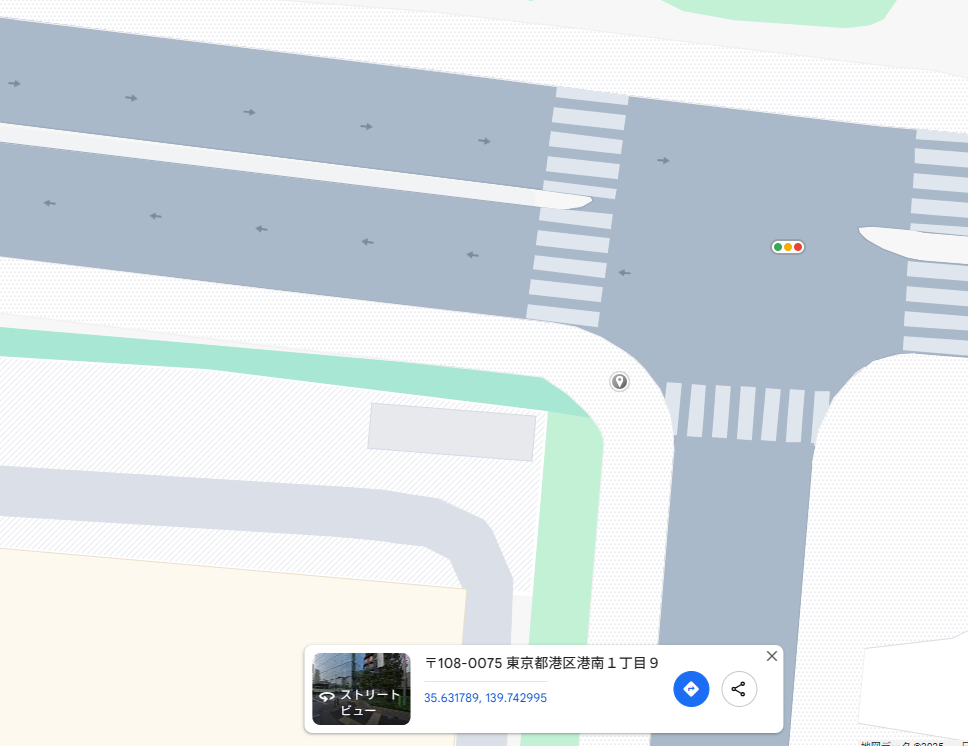

# buildings

## 問題文

あの建物が建ったら、また空が狭くなるんだろうな。
フラグフォーマットはこの人が立っている場所の`TsukuCTF25{緯度_経度}`です。ただし、緯度および経度は小数点以下五桁目を切り捨てたものとします。

## 難易度

medium

## 解法

画像検索に書けると、中央の建物が「ロイヤルパークス品川」であることが分かる。

以降は地点の捜索をする。

「ロイヤルパークス品川」は比較的新しい建物の様で、Google ストリートビューには写っていない。

目印となる建物を探す。

- コスモポリス品川
- パークタワー品川ベイワード

などの建物を活用するとよい。

西側の交差点から画角を探すと、撮影地点を特定できた。

``TsukuCTF25{35.6318_139.7430}``
