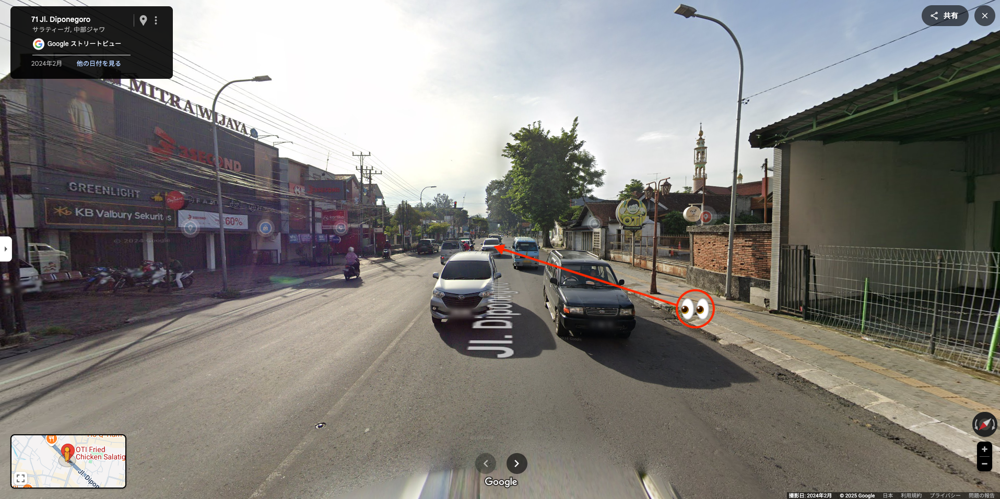

# rider

## 問題文
遠くまで歩き、夕闇に消える足跡
煌めく街頭が、夜の街を飾る
傍らの道には、バイクの群れが過ぎ去り
風の音だけが残る

光と影の中、ふと立ち止まり思う
私は今、どこにいるんだろう

フラグフォーマットはこの人が立っている場所の`TsukuCTF25{緯度_経度}`です。ただし、緯度および経度は小数点以下五桁目を切り捨てたものとします。

## 難易度

Medium

## 解法

信号機や道(歩道)の雰囲気、車やバイクの数、英語を使用する(第一言語とは限らない)から、東南アジア系、特にインドネシアではと推測できます。Google Lensで検索しても、インドネシア関連の結果が多数表示されます。インドネシアかどうか分からない場合は11カ国すべて調査しても良いと思います。

また、画像から場所をピンポイントで特定できそうな情報として、右の「OT」と書かれた看板や、「KURO」と書かれた看板に着目します。

そこで、このように検索をすると、似たロゴを見つけます。

このこの画像から、お店のXやInstagramなどを取得できます。
* https://x.com/otichicken_id
* https://www.instagram.com/otichicken.id

ここで、このお店一覧を探します。しかし、公式サイトがアクセスできない(VPNが必要なのか、サーバが落ちているのかはわからない)ので、[アーカイブ](https://web.archive.org/web/20241123074745/https://otifriedchicken.com/)を確認しますが、店舗一覧は取得できません。

Google Mapで「OTI Fried Chicken」を検索すると、インドネシアの店舗がいくつか表示されます。そのうちの1つに[パンダのロゴで「KURO」と書かれた場所](https://maps.app.goo.gl/KppKiVZcnfRdJenX6)が見つかります。同様に調査していると、OTI Fried ChickenとKuroba Creamy Crepes(パンダの看板のお店)は同じ場所にあることが多い、ということがわかります(ちなみに、写真のOTI Fried Chickenの看板の色が薄いのは色褪せによるものであることもわかります)。

店舗数はKuroba Creamy Crepesの方が少ないことから、こちらを調査します。ここで、Gemini Deep Searchを利用します。すると、以下のお店が出てきます。写真がいつ撮られたのか分からず、お店が閉店していることも考えて、Google Mapは使用していません。

* Kuroba Creamy Crepes, Ungaran
* Kuroba Creamy Crepes, Anjasmoro
* Kuroba Creamy Crepes, Paragon Mall
* Kuroba Creamy Crepes, Ngesrep Timur
* Kuroba Creamy Crepes, Paragon Mall
* Kuroba Creamy Crepes, Kudus
* Kuroba Creamy Crepes, Hasanudin
* OTI Fried Chicken, Woltermonginsidi
* OTI Fried Chicken, Malangsari
* OTI Fried Chicken, Mijen
* OTI Fried Chicken, Kranggan (Heritage)
* OTI Fried Chicken, Anjasmoro
* OTI Fried Chicken, Majapahit
* OTI Fried Chicken, Sampangan
* OTI Fried Chicken, Jepara
* OTI Fried Chicken, Salatiga
* OTI Fried Chicken, Demak
* Kuroba Creamy Crepes, Kelud(閉店)
* Kuroba Creamy Crepes, Ngesrep Timur(閉店)

これを全て調べます。すると、[該当する場所](https://maps.app.goo.gl/YVfDmyYELCSCLfGZ9)が見つかります(画像は撮影者の立っている場所と向いている方向を追記)。

`TsukuCTF25{-7.3189_110.4971}`
