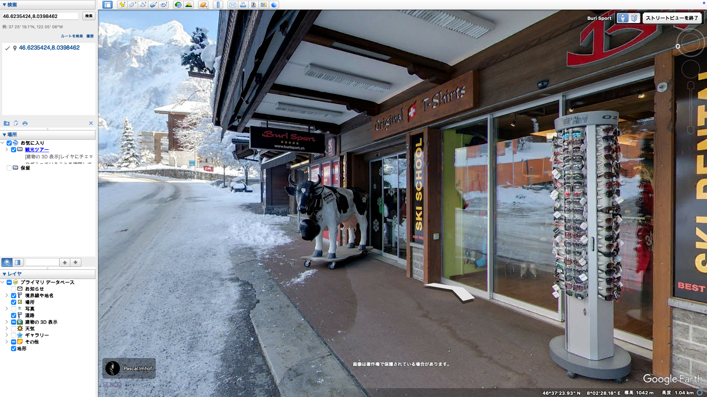

# schnee

## 問題文

素敵な雪山に辿り着いた！スノーボードをレンタルをして、いざ滑走！
フラグフォーマットは写真の場所の座標の小数点第4位を四捨五入して、小数第3位までを`TsukuCTF25{緯度_経度}`の形式で記載してください(例: `TsukuCTF25{12.345_123.456}`)。

## 難易度

medium

## 解法

上の旗のロゴより、[SKISET社](https://www.skiset.co.uk/)が[提供しているエリア](https://www.skiset.co.uk/ski-resorts-france.html)であることがわかる。また、右側に書いてある`EINGANG`はドイツ語で「入り口」という意味であるため、ドイツ語が使用されている場所であることがわかる。つまり、オーストリア、ドイツ、スイスのいずれかの国であることがわかる。

ここで、Google Lensなどを用いて検索すると、以下のサイトがヒットする。

https://niyodogawa.org/blog/outdoor/car/etc/64737/

このサイトの以下の画像をGoogle Lensで検索する。

https://i0.wp.com/niyodogawa.org/wp-content/uploads/2023/09/ef5f94153c027f50ff77ac0bebb4f7b5.jpg?resize=680%2C340&ssl=1

すると、[chris_tiu17氏のinstagramの投稿](https://www.instagram.com/p/DAoNti2TZWd/?img_index=7)がヒットする。この投稿の7枚目の写真から、地域が「Grindelwald, Switzerland」であり、お店の名前が「Buri Sport」であることがわかる。これをGoogle Mapで検索すると3件のみヒットするため、それらを全て調べる。

https://www.google.com/maps/@46.6235424,8.0398462,3a,75y,130.73h,89.76t/data=!3m7!1e1!3m5!1s-63C1a-SHbOa7IWqE7qjyw!2e0!6shttps:%2F%2Fstreetviewpixels-pa.googleapis.com%2Fv1%2Fthumbnail%3Fcb_client%3Dmaps_sv.tactile%26w%3D900%26h%3D600%26pitch%3D0.24340031656302585%26panoid%3D-63C1a-SHbOa7IWqE7qjyw%26yaw%3D130.73349392092055!7i13312!8i6656?authuser=0&entry=ttu&g_ep=EgoyMDI1MDQyMy4wIKXMDSoASAFQAw%3D%3D

なお、上記のストリートビューは少し画像が古いため、若干見た目が異なる。[このGoogle Mapの投稿]([46.623485,8.0399347,3a,75y,90t/data=!3m8!1e2!3m6!1sCIHM0ogKEICAgID-n86p8AE!2e10!3e12!6shttps:%2F%2Flh3.googleusercontent.com%2Fgps-cs-s%2FAB5caB9lhboa8FTRoPv9n3u3vJOXu-xl0toeQQBx6AyLQ-QjstGWawb3zijPtkUgjT4_Za1y8xUJoMteSXDXSCHv9TV8HbV8mqiAywTbq9vSX9G7CdopubZe04fFChyMYB1o_E0yV6wFvw%3Dw203-h270-k-no!7i3024!8i4032!4m11!1m2!2m1!1z44Kw44Oq44Oz44OH44Or44O044Kh44Or44OIIEJ1cmkgU3BvcnQ!3m7!1s0x478f9bedc66333db:0x9353b08d1a5dfaf5!8m2!3d46.623485!4d8.0399347!10e5!15sCibjgrDjg6rjg7Pjg4fjg6vjg7TjgqHjg6vjg4ggQnVyaSBTcG9ydFopIifjgrDjg6rjg7Pjg4fjg6sg44O044Kh44Or44OIIGJ1cmkgc3BvcnSSAQlza2lfc3RvcmWqAWAQASoOIgpidXJpIHNwb3J0KAgyHxABIhuPNwdE-IY5UoCLw6IS6LPTHpVaxx2nJVU_OZQyKxACIifjgrDjg6rjg7Pjg4fjg6sg44O044Kh44Or44OIIGJ1cmkgc3BvcnTgAQA!16s%2Fg%2F11rp0qwy7w?authuser=0&entry=ttu&g_ep=EgoyMDI1MDQyMy4wIKXMDSoASAFQAw%3D%3D#](https://www.google.com/maps/@46.623485,8.0399347,3a,75y,90t/data=!3m8!1e2!3m6!1sCIHM0ogKEICAgID-n86p8AE!2e10!3e12!6shttps:%2F%2Flh3.googleusercontent.com%2Fgps-cs-s%2FAB5caB9lhboa8FTRoPv9n3u3vJOXu-xl0toeQQBx6AyLQ-QjstGWawb3zijPtkUgjT4_Za1y8xUJoMteSXDXSCHv9TV8HbV8mqiAywTbq9vSX9G7CdopubZe04fFChyMYB1o_E0yV6wFvw%3Dw203-h270-k-no!7i3024!8i4032?authuser=0&entry=ttu&g_ep=EgoyMDI1MDQyMy4wIKXMDSoASAFQAw%3D%3D))や、Google Earthの下記の写真などでも確認できる。

`TsukuCTF25{46.624_8.040}`
